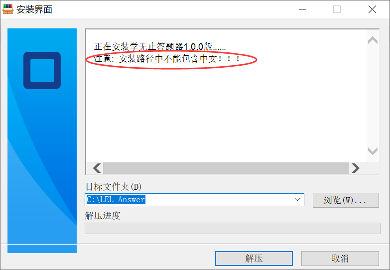
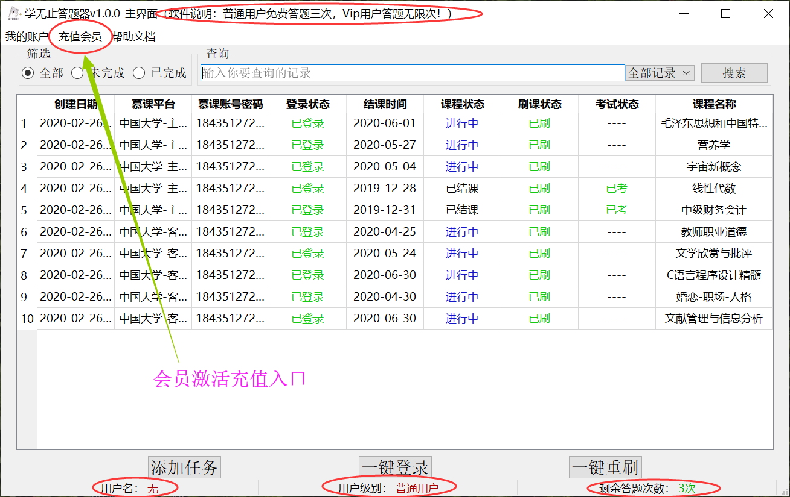
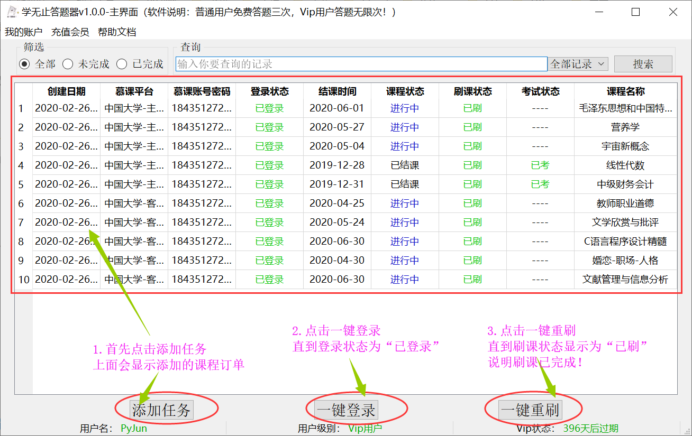
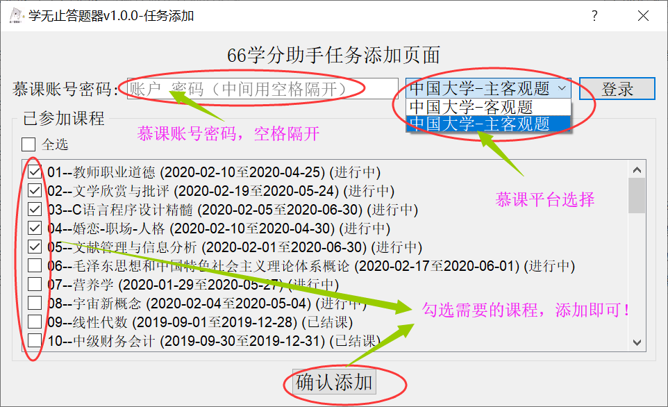

## 学无止答题器

### 1.软件介绍：

- 该软件用于中国大学慕课自动答题，包括自动浏览视频，自动提交主观题和客观题答案，以及参与讨论。
- 软件采用Vip收费机制，普通用户可免费答题三次，Vip用户可以答题无限次，Vip有包日，包月，包年。
- Vip充值采用激活码的形式充值，激活码购买链接：[点此购买](https://pr.kuaifaka.com/item/vv7Y51)
- 帮助文档：[点击帮助](https://shimo.im/docs/HphcyWYWrQCGXwTP)
- 参考博客：[CSDN博客](https://blog.csdn.net/qq_16166591/article/details/104544109)

### 2.下载地址：

- **蓝奏云：**[https://www.lanzous.com/b00ncrztc](https://www.lanzous.com/b00ncrztc)
- **百度网盘：**[https://pan.baidu.com/s/1G43ZZCTc5XtYCeZWUs4uTA](https://pan.baidu.com/s/1G43ZZCTc5XtYCeZWUs4uTA)

### 3.使用说明：

##### 1.从下载地址下载最新版的学无止答题器，安装到本地电脑，注意安装路径下面别带中文！

 

##### 2.打开软件，新用户为普通用户，可以免费答题三次，若要升级为Vip，请用激活码充值！

##### 3.答题流程，首先点击“添加任务”，然后点击”一键登录“，最后点击”一键重刷“，也可以选择右键重刷。

### 4.问题反馈：

##### 邮箱： **py_jun@yeah.net**

### 5.更新计划：

- 将不断加入更多的慕课平台，比如，超星，智慧树等，敬请关注！
