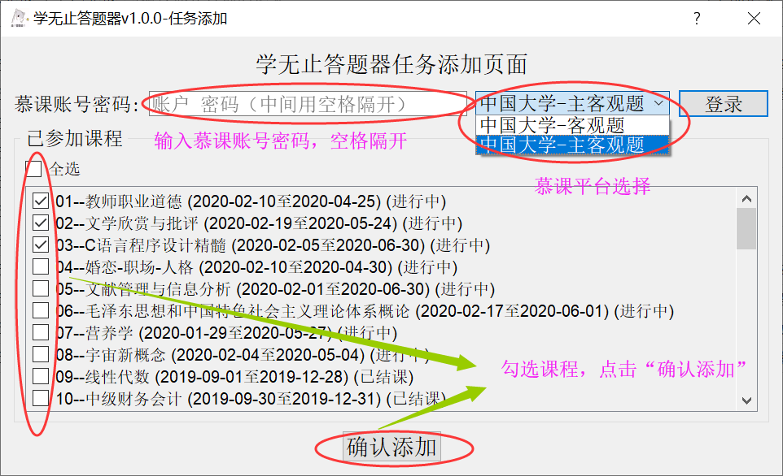

## 学无止答题器

### 1.软件介绍：

- 该软件用于中国大学慕课自动答题，包括自动浏览视频，自动提交主观题和客观题答案，以及参与讨论。
- 官方网站：[点击进入](http://xuewuzhi.net)

### 2.下载地址：

- **蓝奏云：**[https://www.lanzous.com/b00ncrztc](https://www.lanzous.com/b00ncrztc)
- **百度网盘：**[https://pan.baidu.com/s/1G43ZZCTc5XtYCeZWUs4uTA](https://pan.baidu.com/s/1G43ZZCTc5XtYCeZWUs4uTA)

### 3.使用说明：

##### 1.从下载地址下载最新版的学无止答题器，安装到本地电脑，注意安装路径下面别带中文！

 

##### 2.答题流程，首先点击“添加任务”，然后点击”一键登录“，最后点击”一键重刷“，也可以选择右键重刷。

### 4.问题反馈：

##### 邮箱： **py_jun@yeah.net**

### 5.更新计划：

- 将不断加入更多的慕课平台，比如，超星，智慧树等，敬请关注！
